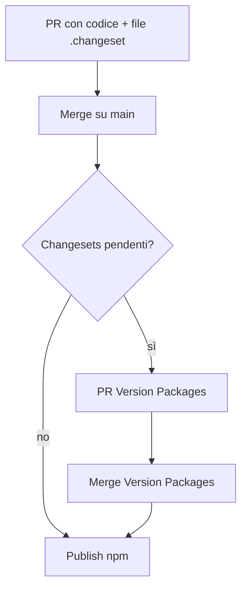

# Release: versioni, changelog e pubblicazione npm

Guida operativa per pubblicare i pacchetti del monorepo **just-dom** dopo aver completato le modifiche. Il flusso ufficiale usa [Changesets](https://github.com/changesets/changesets); la pubblicazione su **npm** avviene in CI su `main` (OIDC, senza OTP) oppure in locale con account npm + 2FA.

## Pacchetti pubblicabili

| Cartella | Nome npm | Note build |
|----------|----------|------------|
| `packages/just-dom` | `just-dom` | `pnpm build` → `dist/` |
| `packages/plugins/lucide` | `@just-dom/lucide` | build richiesta |
| `packages/plugins/router` | `@just-dom/router` | build richiesta |
| `packages/plugins/signals` | `@just-dom/signals` | build richiesta |
| `packages/create-just-dom` | `create-just-dom` | solo `bin/` (nessun `dist`) |

Pacchetti **non** pubblicati su npm: `apps/site`, `@workspace/*`, `skills/`.

Config Changesets: [`.changeset/config.json`](../.changeset/config.json) (`baseBranch`: `main`, accesso `public`).

---

## 1. Prima di aprire la PR (modifiche terminate)

Dalla **root** del monorepo:

```bash
pnpm install
```

Verifiche consigliate sui package toccati:

```bash
# Esempio: solo router
pnpm --filter @just-dom/router test
pnpm --filter @just-dom/router build

# Core + plugin insieme
pnpm exec turbo build --filter=just-dom --filter=@just-dom/router --filter=@just-dom/lucide --filter=@just-dom/signals

# Tipi playground (obbligatorio se cambia l’API pubblica di just-dom)
pnpm run check:playground-types
```

Se `check:playground-types` fallisce, rigenera e committa:

```bash
pnpm run sync:playground-types
git add apps/site/src/views/playground/playground-globals.generated.ts
```

Aggiorna la documentazione sul sito se serve (`apps/site/src/content/docs/…`) e i README dei package.

### Changelog nei package

- Le voci che finiscono su npm durante il bump le genera **Changesets** da file in `.changeset/`.
- Sezioni manuali `## Unreleased` nei `CHANGELOG.md` dei package sono opzionali (note interne); alla release conviene avere già descritto il cambiamento nel changeset (passo 2).

---

## 2. Creare un changeset

Sempre dalla root:

```bash
pnpm changeset
```

Interattivo:

1. Spazio per selezionare i package modificati (↑↓, spazio, invio).
2. Tipo di bump per ciascuno: `patch` | `minor` | `major`.
3. Testo in inglese (finisce nel `CHANGELOG.md` del package).

Viene creato un file `.changeset/<nome-random>.md`, da **committare** insieme al codice:

```bash
git add .changeset/
git commit -m "chore: add changeset for router scroll restoration"
```

Esempio di file changeset:

```md
---
"@just-dom/router": minor
---

Add scroll restoration (default `scroll: "restore"`).
```

Più package nella stessa release:

```md
---
"just-dom": patch
"@just-dom/router": minor
---

Router scroll restoration; fix DOM factory edge case in core.
```

---

## 3. Aprire e mergiare la PR

```bash
git push -u origin <tuo-branch>
```

Apri la PR verso **`main`**. La CI ([`.github/workflows/ci.yml`](../.github/workflows/ci.yml)) esegue `pnpm run check:playground-types` se tocchi `just-dom`.

Dopo review, merge su `main`.

---

## 4. Release stabile (automatica su `main`)

Il workflow [`.github/workflows/release.yml`](../.github/workflows/release.yml) (`changesets/action`):

1. Se ci sono changeset pendenti → apre (o aggiorna) una PR **“Version Packages”** con:
   - bump di `version` in ogni `package.json` interessato;
   - `CHANGELOG.md` aggiornati;
   - rimozione dei file in `.changeset/`.
2. Quando quella PR è **mergiata** su `main`, lo stesso workflow esegue `pnpm release` e pubblica su npm.

Comandi equivalenti in locale (solo per capire cosa fa la CI):

```bash
# Applica versioni + changelog (come la PR "Version Packages")
pnpm version-packages

# Build pacchetti pubblicati dal root script + tipi playground + publish
pnpm release
```

Lo script `release` nel root [`package.json`](../package.json) oggi esegue:

```bash
turbo build --filter=just-dom --filter=@just-dom/lucide --filter=@just-dom/router
pnpm --filter site run generate:playground-types
changeset publish
```

Se in una release pubblichi **solo** `@just-dom/signals` o `create-just-dom`, assicurati che il build sia a posto prima del publish (es. aggiungi il filter a `release` o builda a mano):

```bash
pnpm --filter @just-dom/signals build
```

### Flusso riassunto (stabile)



Non serve OTP in CI: **npm Trusted Publishing** (OIDC) sul repo GitHub.

---

## 5. Release in locale (alternativa)

Utile per debug o se la CI non può pubblicare.

```bash
pnpm install
pnpm version-packages   # opzionale: se vuoi bumpare senza la PR bot
pnpm release
```

Con **2FA** npm attiva:

```bash
NPM_CONFIG_OTP=123456 pnpm release
# oppure
pnpm exec changeset publish --otp 123456
```

Login npm (se serve):

```bash
npm login
```

Verifica pubblicazione:

```bash
npm view just-dom version
npm view @just-dom/router version
```

---

## 6. Canale `dev` (prerelease)

Push sul branch **`dev`** attiva `release-dev` nello stesso workflow:

- Bump versione con suffisso `dev.<run>.<attempt>.<sha>` per `just-dom` e `@just-dom/lucide` (vedi workflow).
- `npm publish --tag dev` (non aggiorna `latest`).

Non usa Changesets; è un canale di anteprima separato. Per release stabili usare sempre `main` + changeset.

---

## 7. Dopo la pubblicazione

- Controlla le versioni su [npm](https://www.npmjs.com/org/just-dom) e per `just-dom` / `create-just-dom`.
- Il sito su Vercel si aggiorna al deploy di `main` (documentazione); i consumer npm vedono subito i nuovi tarball.
- Se il CLI scaffold deve allineare dipendenze ai nuovi semver, valuta un bump di `create-just-dom` nel changeset successivo.

### Versione npm errata

Entro la finestra di unpublish npm:

```bash
npm unpublish just-dom@<version-sbagliata>
```

Se non è consentito, pubblica la versione corretta con `pnpm release` e depreca:

```bash
npm deprecate just-dom@<version-sbagliata> "wrong semver; use <versione-corretta>"
```

Vedi anche le note in [README.md](../README.md#development).

---

## Checklist rapida

| Step | Comando / azione |
|------|------------------|
| Test/build package | `pnpm --filter <pkg> test` / `build` |
| API core cambiata | `pnpm run check:playground-types` |
| Dichiarare bump | `pnpm changeset` → commit `.changeset/*.md` |
| Merge feature PR | → `main` |
| Merge PR versioni | bot Changesets → merge |
| Publish | automatico (`pnpm release` in CI) |
| Verifica npm | `npm view <pkg> version` |

---

## Riferimenti

- [README.md — Development / Releases](../README.md#development)
- [packages/plugins/README.md](../packages/plugins/README.md)
- [apps/site/README.md — Playground types](../apps/site/README.md#playground-types)
- [Changesets documentation](https://github.com/changesets/changesets/blob/main/docs/intro-to-using-changesets.md)
